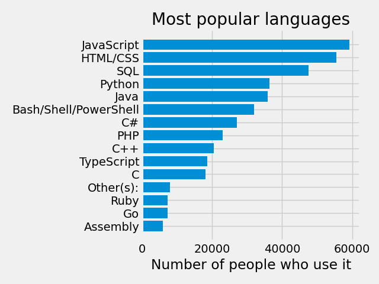
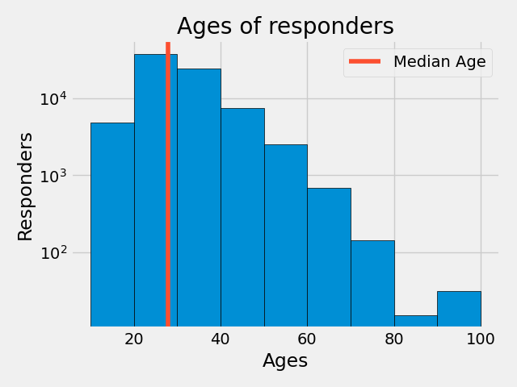
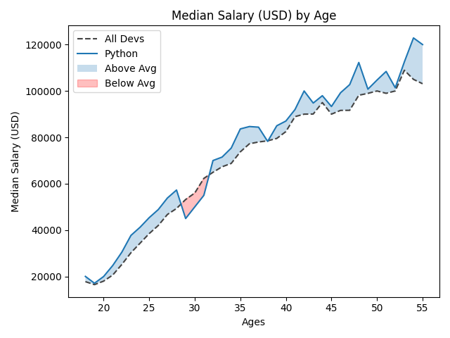
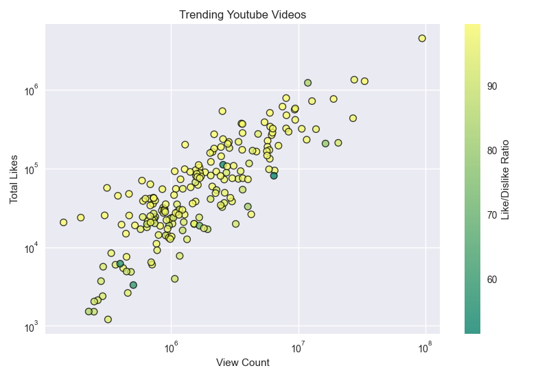
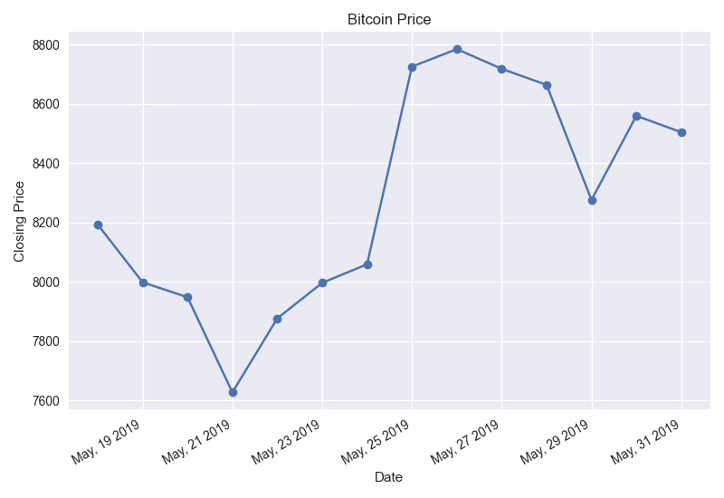
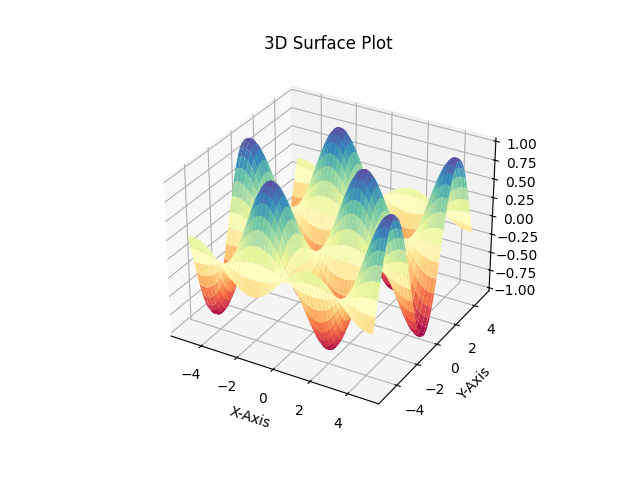
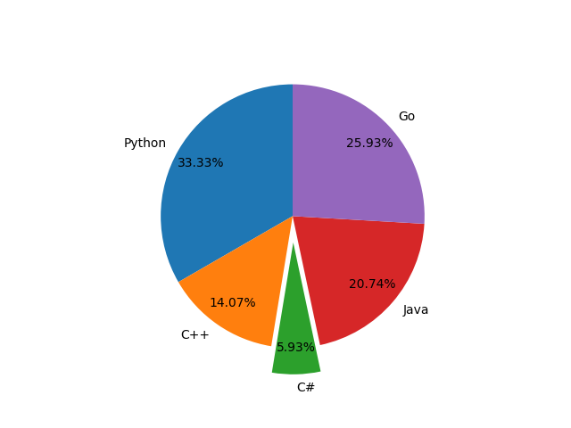
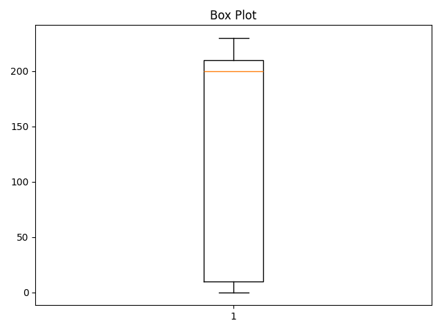
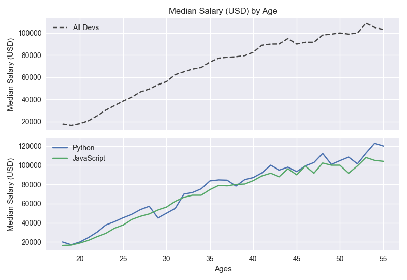

# Matplotlib Practice

A collection of small scripts I wrote while learning **Matplotlib**, **CSV data handling**, and different types of plots.  
Each script focuses on one concept and can be run individually.

Requires **Python 3.10+**.

---

## Run the project

```bash
# 1. (Optional) Create a virtual environment if it doesn’t exist
python3 -m venv venv

# 2. Activate virtual environment
source venv/bin/activate

# 3. Install dependencies (only once)
pip install -r requirements.txt

# 4. Run the project
python main.py

# 5. Deactivate virtual environment
deactivate

#6. When new dependency is added, run
pip freeze > requirements.txt
```

---

## Project Structure

```
images/                      # Images of plots
lib/
 ├── data/                    # CSV files used in some plots
 ├── bar_plot.py
 ├── box_plot.py
 ├── dynamic_data_plot.py
 ├── histogram_plot.py
 ├── income_line.py
 ├── line_area_plot.py
 ├── pie_plot.py
 ├── scatter_plot.py
 ├── stack_plot.py
 ├── sub_plot.py
 ├── style_demo.py
 ├── time_series_plot.py
 └── 3d_plot.py
README.md
requirement.txt
```

---

## Running the Scripts

From project root:

```bash
python lib/<script_name>.py
```

Example:

```bash
python lib/bar_plot.py
```

### Live Dynamic Plot

```bash
# Terminal 1 – generate data continuously
python lib/data/dynamic_data_gen.py

# Terminal 2 – show the live plot
python lib/dynamic_data_plot.py
```

---

# Plots Overview

Below are all plot types included in this project, with script links and image placeholders.

---

## 1. Bar Plot — Most Popular Languages

**Script:** [`bar_plot.py`](lib/bar_plot.py)  
**Data:** `languages.csv`  
<br>



---

## 2. Histogram — Ages of Responders

**Script:** [`histogram_plot.py`](lib/histogram_plot.py)  
**Data:** `ages.csv`  
<br>



---

## 3. Line + Area Plot — Developer Salaries

**Script:** [`line_area_plot.py`](lib/line_area_plot.py)  
**Data:** `salary.csv`  
<br>



---

## 4. Scatter Plot — YouTube View to Like Ratio

**Script:** [`scatter_plot.py`](lib/scatter_plot.py)  
**Data:** `youtube_view_to_like_ratio.csv`  
<br>



---

## 5. Time Series Plot — Bitcoin Price

**Script:** [`time_series_plot.py`](lib/time_series_plot.py)  
**Data:** `bitcoin_price.csv`  
<br>



---

## 6. Live Dynamic Plot — Streaming Data

**Script:** [`live_data_plot.py`](lib/live_data_plot.py)  
**Data Source:** `dynamic_data_gen.csv`  
<br>


---

## 7. 3D Surface Plot

**Script:** [`3d_plot.py`](lib/3d_plot.py)  
<br>



---

## 8. Pie Chart — Language Popularity

**Script:** [`pie_plot.py`](lib/pie_plot.py)  
<br>



---

## 9. Box Plot

**Script:** [`box_plot.py`](lib/box_plot.py)  
<br>



---

## 10. Stack Plot

**Script:** [`stack_plot.py`](lib/stack_plot.py)  
<br>


---

## 11. Subplots — Multiple Salary Graphs

**Script:** [`sub_plot.py`](lib/sub_plot.py)  
<br>


